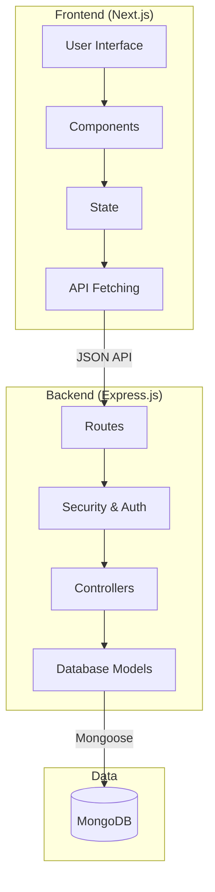
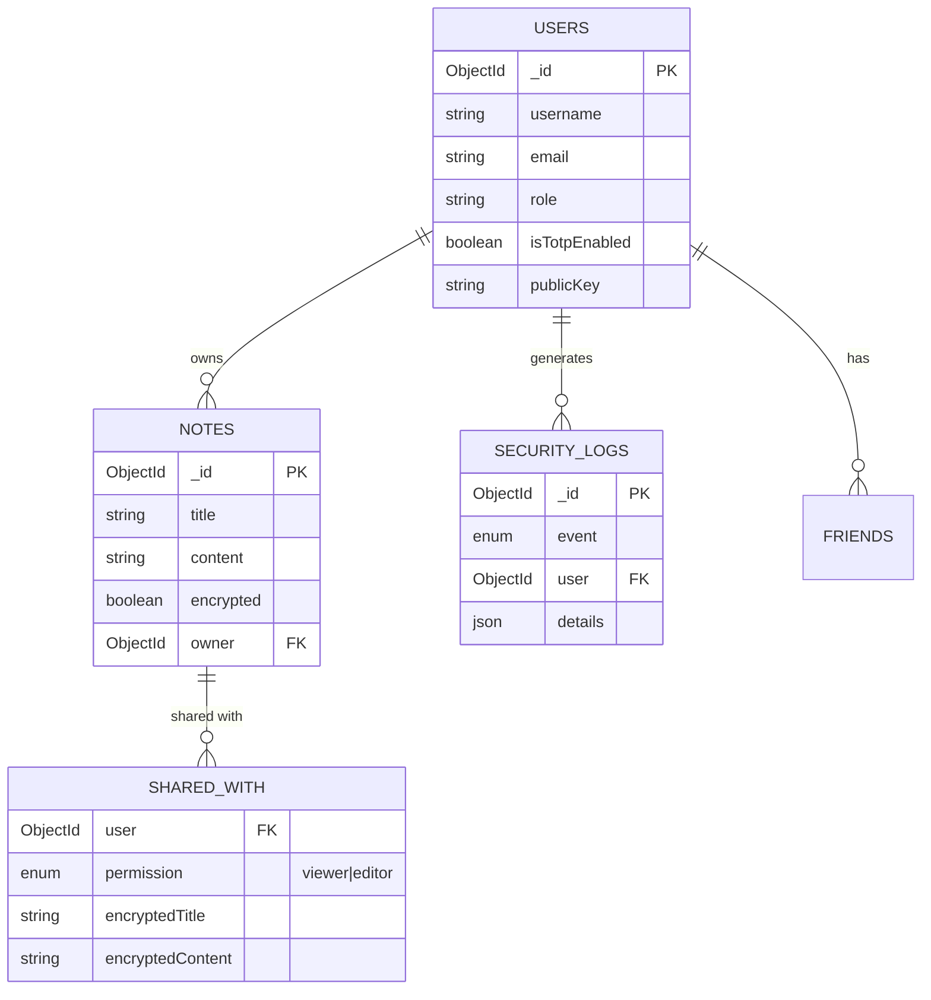

# SecureNote


SecureNote is a simple, private way to share notes. It's built with end-to-end encryption principles, 2FA, and proper access controls so you can keep your data safe.

---

## What it does
- **Authentication**: JWT-based login with Google, GitHub, or local accounts.
- **2FA**: Extra security using TOTP (apps like Google Authenticator).
- **Access Control**: Admin and User roles with their own dashboards.
- **Note Sharing**: Share notes with friends (view or edit permissions).
- **Markdown Support**: Take notes using rich markdown.
- **Audit Logs**: Admins can see security events and logs.
- **Docker Ready**: Containers for easy setup.

---

## Tech Stack
- **Frontend**: Next.js, React, TypeScript, Tailwind CSS.
- **Backend**: Node.js, Express.js, Passport.js.
- **Database**: MongoDB (via Mongoose).
- **Security**: Bcrypt, JWT, Speakeasy (TOTP), Helmet.
- **Infrastructure**: Docker & Docker Compose.

---

## Architecture
We keep things clean by separating the UI from the backend logic.



---

## Security
We use a "Verify Everything" approach:
1. **JWT Identity**: Every API hit checks your token and permissions.
2. **Least Privilege**: You only see what you own or what's specifically shared with you.
3. **Optimistic Locking**: We use versioning (`__v`) to prevent data loss if two people edit the same note at once.

---

## Database Schema
Here's how we structure the data.



---

## Screenshots

### User Dashboard
| Dashboard | Notes | Friends |
| :---: | :---: | :---: |
|  |  |  |

### Admin View
| Overview | Users | Logs |
| :---: | :---: | :---: |
|  |  |  |

---

## Setup Guide

### What you'll need
- **Node.js**: v18 or newer.
- **Docker**: If you want to run everything in containers (easiest).
- **MongoDB**: If you're running the backend manually.

### Installation
1. **Clone it**:
   ```bash
   git clone https://github.com/StealthMoud/secure-note.git
   cd secure-note
   ```

2. **Auto Setup**:
   Run the setup script to install dependencies, generate keys, and configure environments automatically.
   ```bash
   chmod +x scripts/setup_project.sh
   ./scripts/setup_project.sh
   # This will create your .env files with fresh cryptographic keys and install npm packages.
   ```

### Running the app

**Using Docker (Recommended)**
```bash
docker compose up --build
```
- Frontend: `http://localhost:3000`
- Backend: `http://localhost:5002`

**Creating an Admin User**
Once the app is running (and the database is up), you can create a superadmin account by running this script in your terminal:
```bash
node scripts/db/create-superadmin.js <username> <email> <password>
# Example: node scripts/db/create-superadmin.js admin admin@example.com mysecretpass
```

**Manual Dev Mode**
If you prefer running without Docker:
```bash
# Start backend
npm run start:backend

# Start frontend
npm run dev:frontend
# Note: You'll need a local MongoDB instance running on port 27017.
```

---

## License
MIT. Check the `LICENSE` file for details.

