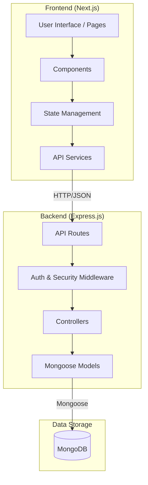
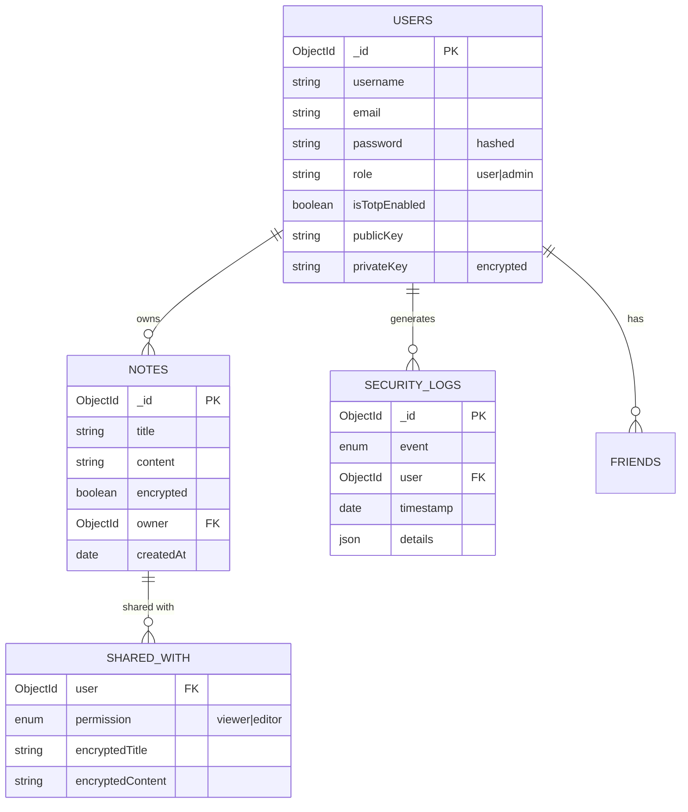

# SecureNote


**SecureNote** is a robust, full-stack web application designed for secure note-sharing and access control. Built with a privacy-first approach, it features end-to-end encryption principles, two-factor authentication (TOTP), and granular role-based access control.

---

## Overview

SecureNote empowers users to create, share, and manage encrypted notes securely. Whether you are an individual wanting to keep private thoughts safe or a team sharing sensitive information, SecureNote provides the tools you need.

### Live Demo


### Key Features
-   **Secure Authentication**: Robust JWT-based auth with Passport.js strategies (Local, Google, GitHub).
-   **Two-Factor Authentication**: Integrated TOTP (Time-based One-Time Password) for an extra layer of security.
-   **Role-Based Access Control**: Distinct User and Admin roles with specialized dashboards.
-   **Verified Identity**: Email verification and secure password reset workflows.
-   **Secure Sharing**: Share notes with friends with view or edit permissions.
-   **Rich Note Management**: Create, edit, and delete notes with support for Markdown.
-   **Audit Logging**: Comprehensive security logging for admins to monitor suspicious activities.
-   **Dockerized**: Fully containerized for consistent deployment across environments.

---

## System Architecture

SecureNote follows a modern layered architecture, separating concerns between the presentation, business logic, and data access layers.



---

## Tech Stack

| Layer | Technologies |
| :--- | :--- |
| **Frontend** | [Next.js](https://nextjs.org/), [React](https://reactjs.org/), [TypeScript](https://www.typescriptlang.org/), [Tailwind CSS](https://tailwindcss.com/) |
| **Backend** | [Node.js](https://nodejs.org/), [Express.js](https://expressjs.com/), [Passport.js](https://www.passportjs.org/) |
| **Database** | [MongoDB](https://www.mongodb.com/), [Mongoose](https://mongoosejs.com/) |
| **Security** | [Bcrypt](https://www.npmjs.com/package/bcryptjs), [JsonWebToken](https://jwt.io/), [Speakeasy](https://github.com/speakeasyjs/speakeasy) (TOTP), [Helmet](https://helmetjs.github.io/) |
| **DevOps** | [Docker](https://www.docker.com/), [Docker Compose](https://docs.docker.com/compose/) |


---

## Security & Zero Trust Architecture

SecureNote implements a **Zero Trust** architecture ("Never Trust, Always Verify") through:

1.  **Strict Identity Verification**: Every request to API endpoints is authenticated via JWT. Access checks are performed at the controller level (e.g., `noteController.js`) to ensure users only access their own data.
2.  **Least Privilege**: Users have role-based access (User/Admin). Friends are explicitly granted "Viewer" or "Editor" permissions.
3.  **Security Headers**: Helmet.js enforces `Content-Security-Policy` and other headers to prevent XSS and other attacks.
4.  **Rate Limiting**: API requests are limited to prevent abuse (DDoS protection), demonstrating effective NFR implementation.

### Concurrency Control
To handle **Live Note Modifications**, the system uses **Optimistic Locking**:
- Each note has a `__v` version field.
- When updating, the system checks if the version in the database matches the version sent by the client.
- If a conflict occurs (another user updated the note), the request is rejected (409 Conflict), ensuring data consistency without expensive locking.

---

## Database Design

The database schema is designed to support secure user management, relationship handling, and encrypted note storage.



---

## Interface Previews

### User Dashboard

| Dashboard | Notes | Friends |
| :---: | :---: | :---: |
|  |  |  |

**User Tools:**
| Notifications | Profile | Account Settings |
| :---: | :---: | :---: |
|  |  |  |

### Admin Panel

| Overview | Users Management | Security Logs |
| :---: | :---: | :---: |
|  |  |  |

---

## Getting Started

This project is set up as an **NPM Workspace** for better dependency management.

### Prerequisites

-   [Node.js](https://nodejs.org/) (v18+)
-   [Docker](https://www.docker.com/) (Optional, for containerized DB/App)
-   [MongoDB](https://www.mongodb.com/) (If running locally without Docker)

### Installation

1.  **Clone the repository**:
    ```bash
    git clone https://github.com/StealthMoud/secure-note.git
    cd secure-note
    ```

2.  **Install dependencies**:
    From the root directory, install dependencies for both backend and frontend:
    ```bash
    npm install
    ```

### Environment Setup

1.  **Backend & Docker**:
    Copy the example environment file to the root directory (for Docker) AND to the backend directory (for manual runs).
    ```bash
    cp .env.example .env
    cp .env.example backend/.env
    ```

2.  **Frontend**:
    Create a local environment file in the frontend directory.
    ```bash
    cp frontend/.env.local.example frontend/.env.local
    ```

3.  **Configure Secrets**:
    Open the `.env` files and update the `JWT_SECRET`, `MONGO_URI`, and OAuth credentials with your own values.

### Running the Application

**Option 1: Using Docker (Recommended)**
```bash
docker-compose up --build
```
-   Frontend: `http://localhost:3000`
-   Backend API: `http://localhost:5000`

**Option 2: Manual Local Dev**
You can run the backend and frontend individually using the workspace scripts from the root:

*   **Start Backend**:
    ```bash
    npm run start:backend
    ```
*   **Start Frontend**:
    ```bash
    npm run dev:frontend
    ```

---

## Contribution Guidelines

We welcome contributions! Please follow these steps:

1.  **Fork** the repository.
2.  Create a **Feature Branch** (`git checkout -b feature/AmazingFeature`).
3.  **Commit** your changes (`git commit -m 'Add some AmazingFeature'`).
4.  **Push** to the branch (`git push origin feature/AmazingFeature`).
5.  Open a **Pull Request**.

---

## License

Distributed under the MIT License. See `LICENSE` for more information.

