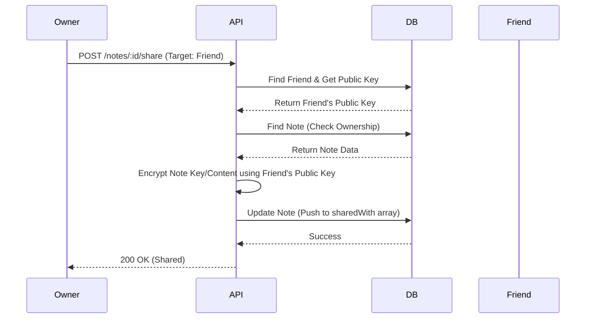

# Architecture Diagrams

## Complex Method: Secure Note Sharing
This sequence diagram details the process of sharing an encrypted note with another user, ensuring key exchange handling.



## "Live Note Modification" Handling
activity diagram ensuring data consistency when two users edit the same note.

```mermaid
graph TD
    A[User A fetches Note (Ver 1)] --> B(Editing in UI)
    C[User B fetches Note (Ver 1)] --> D(Editing in UI)
    B --> E[User A Submits Update (Current Ver: 1)]
    E --> F{DB: matches Ver 1?}
    F -- Yes --> G[Update Success (Ver -> 2)]
    D --> H[User B Submits Update (Current Ver: 1)]
    H --> I{DB: matches Ver 1?}
    G -.-> I
    I -- No (Current DB is Ver 2) --> J[Update Failed (409 Conflict)]
    J --> K[User B notified to refresh]
```
